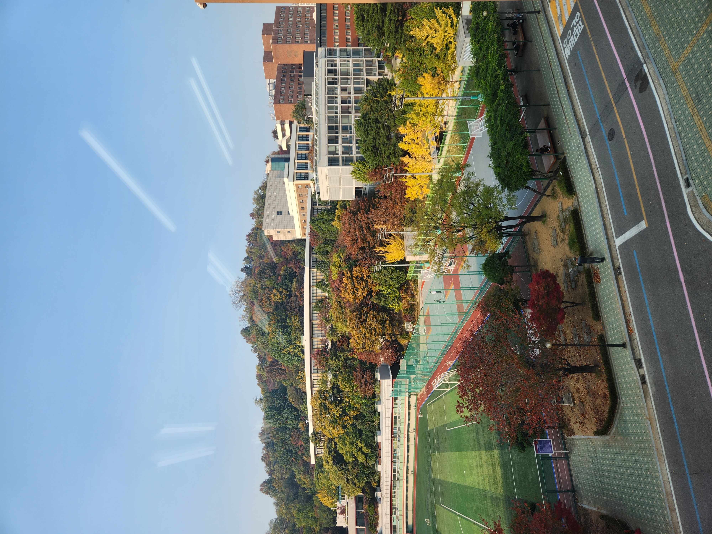
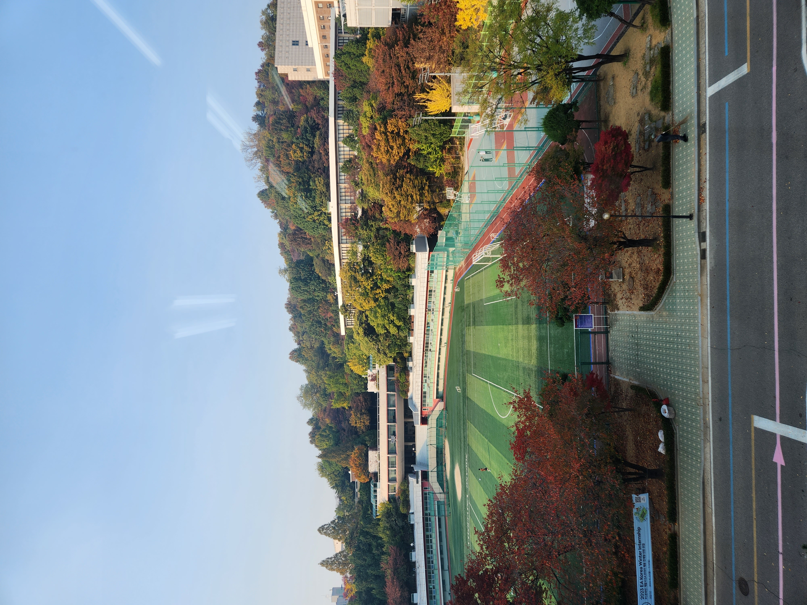

# Automatic stitching of two images

Take two views of images first to run this algorithm.   

For descriptor, I used SIFT descriptors in OpenCV to get the feature points that match between two images.   

After that, I used bruteforce matcher with K nearest neighbor to get the feature points that are strongly related.   

To compute the homography matrix, we need to implement RANSAC algorithm. Since the DoF of homography matrix is 8, we need 4 points to compute the homography matrix.   
For the feature points we got, we randomly choose 4 points from there and compute the singular value decomposition to get the homography matrix.   

For the candidates of homography matrix, we transform the points in one image by transforming them using those homography matrix and compute the distance between the destination points and the transformed source points.   

One that is below the threshold and have the most inliers are the best homography matrix.   
   
By using this homography matrix, we warp the images and make the panorama image.   

